---
# Refactoring for Fun and Profit
<!-- .element: class="r-fit-text" -->
### Evan Kohilas
### @ekohilas

Hello everyone!

And welcome to my story about refactoring!

------


But what is refactoring?

------
<!-- .element: data-background-image="images/poop.svg" data-background-size="contain" -->
```python
for k in d:
    if(   k==p):
        n= d[k]
        break
    n  =None
```

It's the process of improving horrendous code like this

------
<!-- .element: data-background-image="images/hearts.png" data-background-size="contain" -->
```python
def find_number(self, person_name):
    return self.phone_numbers.get(person_name)
```

To beautiful code like this!

------
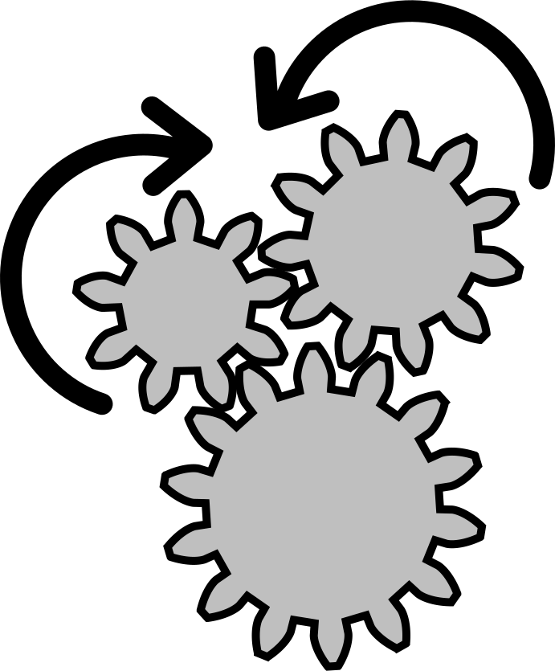

All while ensuring that code still runs, tests still pass, functionality is kept the same, and the user doesn't suspect a thing!

------
```python
for k in d:
    if(   k==p):
        n= d[k]
        break
    n  =None
```

This could be by doing things like

------
```python
for k in d:
    if k == p:
        n = d[k]
        break
    n = None
```

changing formatting

------
```python
for name in phone_numbers:
    if name == person_name:
        number = phone_numbers[name]
        break
    number = None
```

renaming variables

------
```python
def find_number(self, person_name):
    for name in self.phone_numbers:
        if name == person_name:
            return self.phone_numbers[name]
        return None
```

updating the structure

------
```python
def find_number(self, person_name):
    return self.phone_numbers.get(person_name)
```

or using different algorithms and syntactic sugar.

------
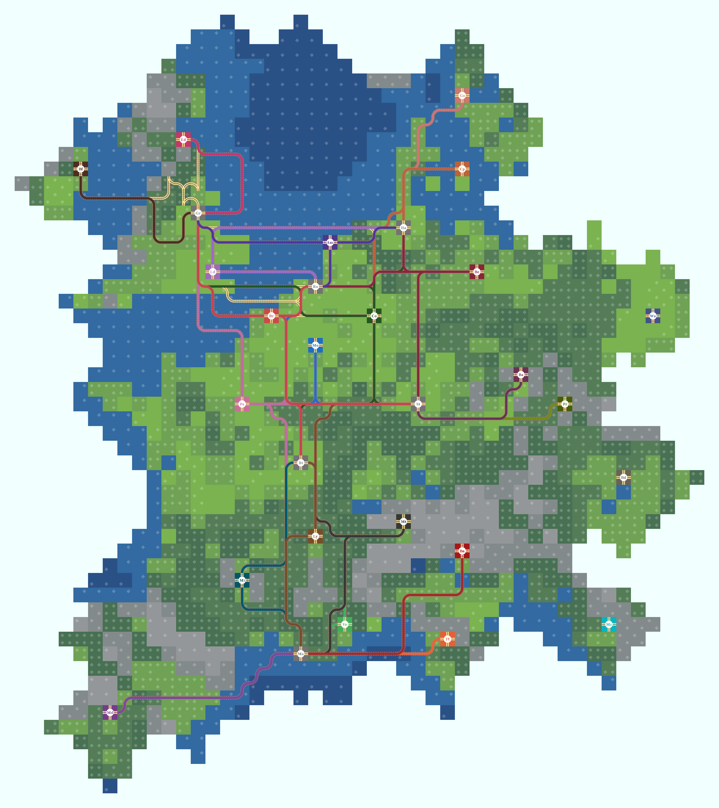

And today, I'll be talking about the story of refactoring a side project of mine that solves, annotates, and validates the minimum paths of this train game.

Woah I'm such a nerd... Anyways...

------


But why am I refactoring it?

------
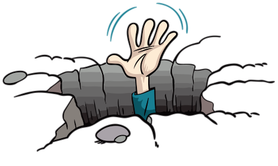

Well I was a bit stuck, and wanted some help from others.

------


Not only that, but it was also hard for me to easily make changes.
And if it was hard for me to understand, well, it would've been even harder for others...

------


Okay so how did I get here?

------


Well often I'll have an idea that I want to implement

------
<div class="r-stack">
    
    
</div>

And python is a great choice for doing so quickly!

------
<!-- .element: data-background-image="images/code.svg" -->

But as I added code

------
<!-- .element: data-background-image="images/code_more.svg" -->

And more code

------
<!-- .element: data-background-image="images/code_more_more.svg" -->

And more code

------
<!-- .element: data-background-image="images/code_more_more.svg" -->


It quickly turned from a small script, to an unmaintainable project...

Wanna see?

No I won't get you to read the entire code, because you don't have to

------


In the same way that you can often just skim an entire article to get an idea of what it's about

------
```python
#!/usr/bin/env python3
import networkx as nx
import matplotlib.pyplot as plt
import json
import csv
from pprint import pprint

dirs = {
    "up":       ( 0, -0.5),
    "right":    ( 0.5,  0),
    "down":     ( 0,  0.5),
    "left":     (-0.5,  0),
}

def main():
    tracks_filename = "tracks_tracks.csv"
    track_grid = read_csv_map(tracks_filename)    

    map_filename = "tracks_map.csv"    
    map_grid = read_csv_map(map_filename)
    
    tiles_filename = "tiles.json"
    tiles_list = read_json(tiles_filename)
    id_to_tile = get_id_to_tile(tiles_list)
    id_to_map_tile = get_id_to_map_tile(tiles_list)

    distances_filename = "distances.json"
    distance_list = read_json(distances_filename)

    connections_filename = "connections.json"
    connections_list = read_json(connections_filename)

    width = len(map_grid[0])
    height = len(map_grid)
    g = grid_2d_graph_on_edges(width, height)
#    g = nx.Graph()
    add_edges_for_tracks(g, track_grid, id_to_tile)
#    g.remove_nodes_from(list(nx.isolates(g)))
    graph_path_lengths = dict(nx.all_pairs_shortest_path_length(g))
#    pprint(path_lengths)
    graph_paths = dict(nx.all_pairs_shortest_path(g))
    checks(g, distance_list, graph_path_lengths, tiles_list, track_grid, id_to_tile, map_grid, id_to_map_tile)
    find_and_save_connections(graph_paths, distance_list, tiles_list, connections_list, width, height)
    
#    draw_with_positions(g)

def verify_track_placements(track_grid, map_grid, id_to_tile, id_to_map_tile):
    check_passed = True
    for y, (track_row, map_row) in enumerate(zip(track_grid, map_grid)):
        for x, (track_tile_id, map_tile_id) in enumerate(zip(track_row, map_row)):
            if not is_track(track_tile_id, id_to_tile):
                continue
            map_tile = id_to_map_tile[map_tile_id]
            track_tile = id_to_tile[track_tile_id]
            map_tile_name = map_tile["name"]
            track_tile_name = track_tile["name"]
            track_tile_type = track_tile["type"]        
            if track_tile_type != "Transparent":
                if map_tile_name not in track_tile["overlays"]:
                    print(f"{track_tile_type} {track_tile_name} track at position ({x}, {y}) can't be placed on {map_tile_name}")
                    check_passed = False
            if map_tile_name in ("Cloud", "Mountain"):
                print(f"{track_tile_type} {track_tile_name} track at position ({x}, {y}) can't be placed on {map_tile_name}")
                check_passed = False
            if track_tile["branching"] and map_tile_name == "Water":
                print(f"{track_tile_type} {track_tile_name} track at position ({x}, {y}) can't be placed on {map_tile_name}")
                check_passed = False
    if check_passed:
        print("All track placements verified. You are awesome!")
    return check_passed
                    

def count_track_positions(track_grid, map_grid, id_to_tile, id_to_map_tile):
    counts = {}
    track_counts = {}
    for track_row, map_row in zip(track_grid, map_grid):
        for track_tile_id, map_tile_id in zip(track_row, map_row):
            if not is_track(track_tile_id, id_to_tile):
                continue
            map_tile = id_to_map_tile[map_tile_id]
            track_tile = id_to_tile[track_tile_id]
            map_tile_name = map_tile["name"]
            track_tile_name = track_tile["name"]
            track_tile_type = track_tile["type"]
            if map_tile_name not in counts:
                counts[map_tile_name] = {}
            if track_tile_name not in counts[map_tile_name]:
                counts[map_tile_name][track_tile_name] = 0
            if track_tile_name not in track_counts:
                track_counts[track_tile_name] = 0
            track_counts[track_tile_name] += 1
            counts[map_tile_name][track_tile_name] += 1

    for map_name, tracks in counts.items():
        print(map_name)
        for track_name, count in sorted(tracks.items(), key=lambda t: t[1], reverse=True):
            print(count, track_name)
        print()
    print("Totals:")
    for track_name, count in sorted(track_counts.items(), key=lambda t: t[1], reverse=True):
        print(count, track_name)
    print()

def is_track(tile_id, id_to_tile):
    print(tile_id)
    if tile_id in id_to_tile:
        print(id_to_tile[tile_id])
    return tile_id in id_to_tile and id_to_tile[tile_id]["group"] == "Track"

def count_tracks(track_grid, id_to_tile):
    count = sum(
        True        
        for row in track_grid
        for tile_id in row
        if is_track(tile_id, id_to_tile)
    )
    print(f"Found {count} tracks.")

def find_and_save_connections(graph_paths, distance_list, tiles_list, connections_list, width, height):
    city_connections = get_connections(graph_paths, distance_list, tiles_list)
    connection_directions = convert_connection_directions(city_connections, connections_list)
    save_connection_directions_to_tmx_csv(connection_directions, width, height)
    
def checks(g, distance_list, graph_path_lengths, tiles_list, tracks_grid, id_to_tile, map_grid, id_to_map_tile):
    count_tracks(tracks_grid, id_to_tile)
    verify_track_placements(tracks_grid, map_grid, id_to_tile, id_to_map_tile)
    count_track_positions(tracks_grid, map_grid, id_to_tile, id_to_map_tile)
    check_all_distances(distance_list, graph_path_lengths, tiles_list)
    find_unused_edges(g, distance_list, tiles_list)

def save_connection_directions_to_tmx_csv(connection_directions, width, height):
    for city_name, position_to_directions_dict in connection_directions.items():
        filename = f"connections/{city_name}.csv"
        print(f"Saving connections at {filename}...")
        with open(filename, "w") as f:
            writer = csv.writer(f)
            for y in range(height):
                row = []
                for x in range(width):
                    if (x, y) in position_to_directions_dict:
                        row.append(position_to_directions_dict[(x, y)])
                    else:
                        row.append(0)
                writer.writerow(row)

def get_connection_tile_id(connections_list, name, directions):
    return [connection["tmx_id"] for connection in connections_list
            if (connection["type"] == name and all(connection[direction] for direction in directions))][0]

def convert_connection_directions(city_connections, connections_list):
    return {
        city_name: {
            position: get_connection_tile_id(connections_list, city_name, directions)
            for position, directions in position_to_directions_dict.items()
        }
        for city_name, position_to_directions_dict in city_connections.items()
    }

def get_connections(graph_paths, distance_list, tiles_list):
    city_connections = {}
    for port_name, distances in distance_list.items():
        for distance_object in distances[:8]:
            city_name = distance_object["name"]
            connections = get_connection_path(graph_paths, port_name, city_name, tiles_list)
            if city_name not in city_connections:
                city_connections[city_name] = connections
            else:
                for position, directions in connections.items():
                    if position not in city_connections[city_name]:
                        city_connections[city_name][position] = directions
                    else:
                        city_connections[city_name][position].update(directions)
    return city_connections

def get_connection_path(paths, port_name, city_name, tiles_list):
    edges = get_path_edges(paths, tiles_list, port_name, city_name)
    return {
        get_position_from_edge(edge): {get_direction_from_edge(edge)}
        for edge in edges
    }

def get_direction_from_edge(edge):
    (x1, y1), (x2, y2) = edge
    if y1 == y2:
        return "horizontal"
    if x1 == x2:
        return "vertical"
    pos = get_position_from_edge(edge)
    directions = {
        value: key
        for key, value in get_edge_nodes(pos).items()
    }
    edge_directions = {
        directions[(x1, y1)],
        directions[(x2, y2)],
    }
    if edge_directions == {"up", "left"}:
        return "up_left"
    if edge_directions == {"up", "right"}:
        return "up_right"
    if edge_directions == {"down", "left"}:
        return "down_left"
    if edge_directions == {"down", "right"}:
        return "down_right"

def get_position_from_edge(edge):
    (x1, y1), (x2, y2) = edge
    if y1 == y2:
        y = y1
        x = (x1 + x2) / 2
    elif x1 == x2:
        x = x1
        y = (y1 + y2) / 2
    else:
        x = x1 if isinstance(x1, int) or x1.is_integer() else x2
        y = y1 if isinstance(y1, int) or y1.is_integer() else y2
    return (int(x), int(y))

def check_all_distances(distance_list, graph_path_lengths, tiles_list):
    print("Checking all distances are minimal...")
    check_passed = True
    for port_name, distances in distance_list.items():
        for distance_object in distances[:8]:
            city_name = distance_object["name"]
            expected_distance = distance_object["distance"]
            actual_distance = get_distance(graph_path_lengths, tiles_list, port_name, city_name)
            if actual_distance != expected_distance:
                check_passed = False
                print(f"{port_name} -> {city_name} distance is non minimal."
                      f"\n\tExpected {expected_distance} but was {actual_distance}."
                )
    if check_passed:
        print("All tests passed. You are awesome!")

def find_unused_edges(g, distance_list, tiles_list):
    print("Looking for unused edges...")
    all_edges = set(g.edges)
    all_edges.update(
        (second, first)
        for first, second in g.edges
    )
    visited_edges = set()
    shortest_paths = dict(nx.all_pairs_shortest_path(g))
    for port_name, distances in distance_list.items():
        for distance_object in distances[:8]:
            city_name = distance_object["name"]
            path_edges = get_path_edges(shortest_paths, tiles_list, port_name, city_name)
            visited_edges.update(path_edges)
            visited_edges.update(
                (second, first)
                for first, second in path_edges
            )
    unvisited_edges = all_edges - visited_edges
    
    reversed_edges = set()
    if unvisited_edges:
        print("Found unused edges:")
        for unvisited_edge in unvisited_edges:
            if unvisited_edge in reversed_edges:
                continue
            first, second = unvisited_edge
            reversed_edges.add((second, first))
            print(unvisited_edge)
    else:
        print("All tests passed. You are awesome!")

def get_edge_nodes(node):
    x, y = node
    return {
        key: (x + dx, y + dy)
        for key, (dx, dy) in dirs.items()
    }

def get_tile_position_by_name(name, tiles_list):
    return [
        (tile["x"], tile["y"])
        for tile in tiles_list
        if tile["name"] == name
    ][0]

def get_path_edges(paths, tiles_list, port_name, city_name):
    city_position = get_tile_position_by_name(city_name, tiles_list)
    port_position = get_tile_position_by_name(port_name, tiles_list)
    city_edge_nodes = get_edge_nodes(city_position).values()
    port_edge_nodes = get_edge_nodes(port_position).values()
    ds = []
    for port_edge_node in port_edge_nodes:
        for city_edge_node in city_edge_nodes:
            lengths = paths[port_edge_node]
            if city_edge_node in lengths:
                ds.append(lengths[city_edge_node])
    min_path = min(ds, key=len)
    edges = set()
    for first_node, second_node in zip(min_path, min_path[1:]):
        edges.add((first_node, second_node))
    return edges

def get_distance(path_lengths, tiles_list, port_name, city_name):
    city_position = get_tile_position_by_name(city_name, tiles_list)
    port_position = get_tile_position_by_name(port_name, tiles_list)
    city_edge_nodes = get_edge_nodes(city_position).values()
    port_edge_nodes = get_edge_nodes(port_position).values()
    ds = []
    for port_edge_node in port_edge_nodes:
        for city_edge_node in city_edge_nodes:
            lengths = path_lengths[port_edge_node]
            if city_edge_node in lengths:
                ds.append(lengths[city_edge_node])
    return min(ds) if ds else 99
#    return [
#        path_lengths[port_edge_node][city_edge_node]
#        if len(path_lengths[port_edge_node]) != 1
#    ]

def draw_with_positions(g):
    pos = nx.get_node_attributes(g, "pos")
    plt.gca().invert_yaxis()
    nx.draw(g, pos, node_size=1)
    plt.show()

def add_edges_for_tracks(g, track_grid, id_to_tile):
    for y, row in enumerate(track_grid):
        for x, id_ in enumerate(row):
            if (
                id_ not in id_to_tile
                or id_to_tile[id_]["group"] != "Track"
            ):
                continue
            track_tile = id_to_tile[id_]
            directions = get_track_directions(track_tile)
            add_edges_for_directions(g, (x, y), directions)

def grid_2d_graph_nodes(g, width, height):
    for x in range(width):
        for y in range(height):
            for dx, dy in dirs.values():
                i, j = x + dx, y + dy
                g.add_node((i, j), pos=(i, j))

def add_edges_for_directions(g, node, directions):
    for direction in directions:
        add_edge_for_direction(g, node, direction)

def add_edge_for_direction(g, node, direction):
    x, y = node
    directions = {
        key: (x + dx, y + dy)
        for key, (dx, dy) in dirs.items()
    }
    up = directions["up"]
    right = directions["right"]
    down = directions["down"]
    left = directions["left"]

    if direction == "vertical":
        g.add_edge(up, down)
        
    if direction == "horizontal":
        g.add_edge(left, right)

    if direction == "up_right":
        g.add_edge(up, right)

    if direction == "down_left":
        g.add_edge(down, left)

    if direction == "down_right":
        g.add_edge(down, right)

    if direction == "up_left":
        g.add_edge(up, left)

def get_track_directions(track_tile):
    directions = [
        "vertical",
        "horizontal",
        "up_right",
        "down_left",
        "down_right",
        "up_left",
    ]
    return [
        direction
        for direction in directions
        if track_tile[direction]
    ]

def grid_2d_graph_on_edges(width, height, all_edges=False):
    g = nx.Graph()

    grid_2d_graph_nodes(g, width, height)
    
    if all_edges:
        for x in range(width):
            for y in range(height):
                dirs = {
                    key: (x + dx, y + dy)
                    for key, (dx, dy) in dirs.items()
                }
                up = dirs["up"]
                right = dirs["right"]
                down = dirs["down"]
                left = dirs["left"]

                g.add_edge(left, up)
                g.add_edge(left, right)
                g.add_edge(left, down)
                
                g.add_edge(up, down)
                g.add_edge(right, up)
                g.add_edge(right, down)

    return g

def read_csv_map(map_filename):
    csv_map = []
    with open(map_filename, newline="") as f:
        for row in csv.reader(f):
            csv_map.append(list(map(int, row)))
    return csv_map

def read_json(json_filename):
    with open(json_filename) as f: 
        return json.load(f)

def get_id_to_map_tile(tiles):
    return {
        int(row["id"]): row
        for row in tiles
    }

def get_id_to_tile(tiles):
    return {
        int(row["group_id"]): row
        for row in tiles
    }

if __name__ == "__main__":
    main()
```

like if we skim through this code

Could you say you have a reasonable idea of what it does? where to start? what's important? how it works? what it's made of?

I know that my answer to that is no.

------
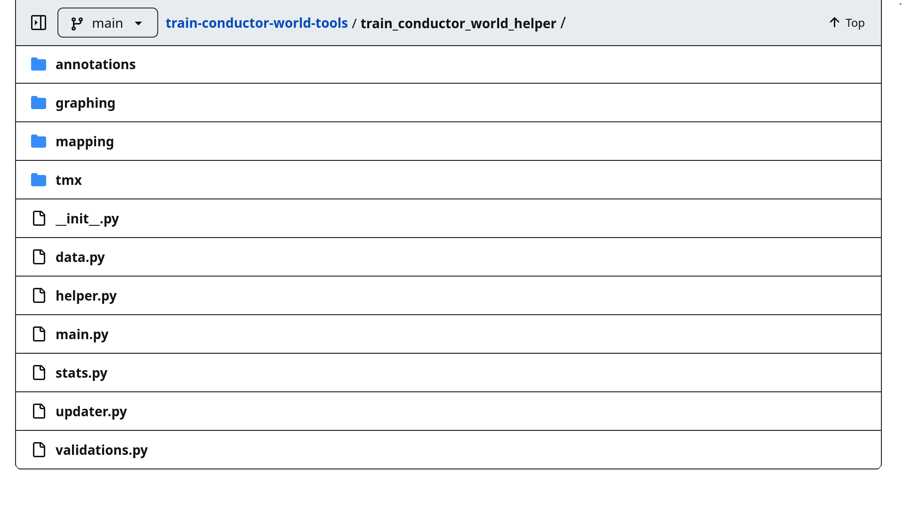

But when I look at where I'm at now, I can very easily hazard that the project has something to do with graphs and annotations and stats and validations.

------


But why was it so messy? How did it become like this?

Well because...

No one is perfect and can:

------


know exactly what all future requirements will be

------
<!-- .element: data-background-image="images/brain-python.svg" -->

know all of the syntactic sugar of a language

------
<!-- .element: data-background-image="images/brain-flowchart.svg" -->

know or identify when to use design principles and patterns

------


or have the time to make these changes upfront

Since with any piece of code, 

------


You can try your best to avoid these problems by having an idea for what to look out for, but you need to stop, step back, and take a look at what you're doing.

------


Okay, so when we stop and take a look, what can we do?

---


Well the first and easiest step we can take is to use a formatter.

------
```python
def connection_tile_id(connections_list, name, directions):
    return [connection [ "tmx_id"] for connection in connections_list if (
        connection["type"]==name and all(connection[direction ] for direction in directions ))][0]
```

It let's us take messy, long, condensed and inconsistently written blocks like this

------
```python
def connection_tile_id(connections_list, name, directions):
    return [
        connection["tmx_id"]
        for connection in connections_list
        if (
            connection["type"] == name
            and all(
                connection[direction]
                for direction in directions
            )
        )
    ][0]
```

and automatically turn them into this, which are much more human readable!

------
```
def connection_tile_id(connections_list, name, directions):
    return [connection [ "tmx_id"] for connection in connections_list if (
        connection["type"]==name and all(connection[direction ] for direction in directions ))][0]
```
<!-- .element: style="filter: blur(3px)" -->

Even if I blur the examples to simulate skimming them

------
```python
def connection_tile_id(connections_list, name, directions):
    return [
        connection["tmx_id"]
        for connection in connections_list
        if (
            connection["type"] == name
            and all(
                connection[direction]
                for direction in directions
            )
        )
    ][0]
```
<!-- .element: style="filter: blur(3px)" -->

It's probably a lot easier to tell in the formatted case that we're filtering a list

------
<!-- .element: data-background-image="images/formatters.png" -->

Now in terms of formatters, there's a couple you can choose from, so you could spend a couple of hours researching each one and taking a look at what they do...

------


No! Wait, do you really want to do that?

I mean if your goal is to learn, sure!

------
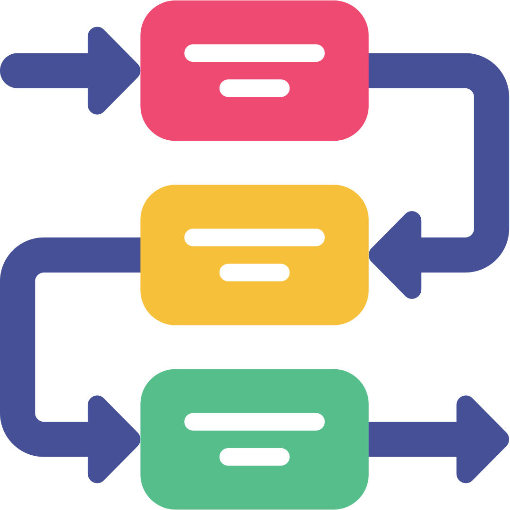

But a good methodology to take away here, right from the beginning is one about pragmatism.

------


Because one of the biggest qualms of refactoring is the amount of time it can take.

------
☑☐☐☐☐
<!-- .element class="r-fit-text" -->

It's important to realise when something is good enough.
So if you're trying to be pragmatic, just pick the first thing you find!

------


I chose to use black. It's opinionated, but that doesn't matter to me.
All that matters to me is that my code is always formatted to be readable and consistent, because in future, trusting the formatter to automatically fix things, and not having to debate with others is what will save me time.
And if I do find issues, it would be very easy to swap out later, cause they can just reformat all the code!

---
```python
c = (f - 32) * 5/9
celcius2 = (farenheight2 - 32) * 5/9
c - celcius2
```

But even formatted code can like this can still have issues.

Formatters won't tell you about code smells like

------
```python [1]
c = (f - 32) * 5/9
celcius2 = (farenheight2 - 32) * 5/9
c - celcius2
```

problematic naming, like single characters...

------
```python [2]
c = (f - 32) * 5/9
celcius2 = (farenheight2 - 32) * 5/9
c - celcius2
```

spelling mistakes, like celcius and farenheight...

------
```python [3]
c = (f - 32) * 5/9
celcius2 = (farenheight2 - 32) * 5/9
c - celcius2
```

unused code, like this last line...

------
```python [1-2]
c = (f - 32) * 5/9
celcius2 = (farenheight2 - 32) * 5/9
c - celcius2
```

or duplicated code.

------
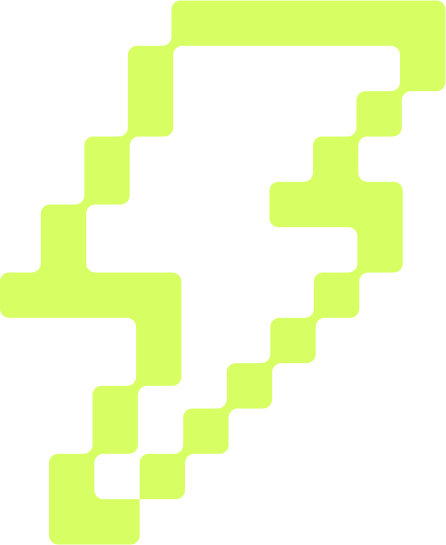

But a linter like Ruff will!

Linters are great because they can look at all your code as you write it and raise issues for fixing that you might not be aware of.

------
<!-- .element: data-background-image="images/linting_rules.png" -->

There's a whole list of them, and you don't have to follow all of them (you can even silence the ones you don't like)

But they often guide you into good patterns that you might have otherwise not considered.

---
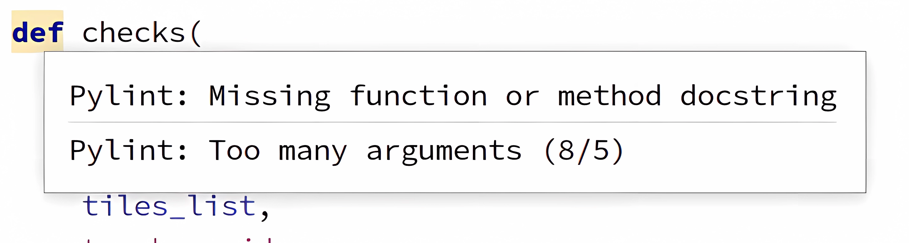<!-- .element: style="height: unset" -->

Like this warning I got, about my function having too many arguments.

While at first it made me think, "That's silly, what's wrong with that?"

------


But when I took a step back, and thought about how to address it, it made me realise what was better.

------
```python
map_filename = "map.csv"
map_grid = read_csv_map(map_filename)

tracks_filename = "tracks.csv"
tracks_grid = read_csv_map(tracks_filename)

tiles_filename = "tiles.json"
tiles_list = read_json(tiles_filename)
id_to_tile = get_id_to_tile(tiles_list)
id_to_map_tile = get_id_to_map_tile(tiles_list)

distances_filename = "distances.json"
distance_list = read_json(distances_filename)
```

If we take a look at the beginning,

We'll see there's a bunch of code

------
```python [2,5,8-10,13]
map_filename = "map.csv"
map_grid = read_csv_map(map_filename)

tracks_filename = "tracks.csv"
tracks_grid = read_csv_map(tracks_filename)

tiles_filename = "tiles.json"
tiles_list = read_json(tiles_filename)
id_to_tile = get_id_to_tile(tiles_list)
id_to_map_tile = get_id_to_map_tile(tiles_list)

distances_filename = "distances.json"
distance_list = read_json(distances_filename)
```

and some of that code loads some state into multiple variables

------
<!-- .element: data-auto-animate -->
```python []
def checks(
    g,
    graph_path_lengths,
    distance_list,
    map_grid,
    tracks_grid,
    tiles_list,
    id_to_tile,
    id_to_map_tile,
):
```
<!-- .element: data-id="variables" -->

And then we take those variables, and pass them into our function with many many arguments...

------
<!-- .element: data-auto-animate -->
```python [11-15]
def checks(
    g,
    graph_path_lengths,
    distance_list,
    map_grid,
    tracks_grid,
    tiles_list,
    id_to_tile,
    id_to_map_tile,
):
    count_tracks(tracks_grid, id_to_tile)
    verify_track_placements(map_grid, tracks_grid, id_to_tile, id_to_map_tile)
    count_track_positions(map_grid, tracks_grid, id_to_tile, id_to_map_tile)
    check_all_distances(distance_list, graph_path_lengths, tiles_list)
    find_unused_edges(g, distance_list, tiles_list)
```
<!-- .element: data-id="variables" -->

and then we pass those variables again individually to other functions.

------


While this was better than just having everything as global variables, it was so messy!

------


Instead, a better idea was to compartmentalise everything by putting these functions as part of a class

------
```python [1-4]
class Data:

    def __init__(
        ...
    ):
        self.distance_list = read_json(distances_filename)
        self.tracks_grid = read_csv_map(tracks_filename)
        self.map_grid = read_csv_map(map_filename)
        self.tiles_list = read_json(tiles_filename)
        self.connections_list = read_json(connections_filename)
```

For example, by introducing a data holding class

------
```python [6-13]
class Data:

    def __init__(
        ...
    ):
        self.distance_list = read_json(distances_filename)
        self.tracks_grid = read_csv_map(tracks_filename)
        self.map_grid = read_csv_map(map_filename)
        self.tiles_list = read_json(tiles_filename)
        self.connections_list = read_json(connections_filename)
```

That lets me section off creating, storing, and loading data elsewhere.

------
<!-- .element: data-auto-animate -->
```python []
def checks(
    g,
    graph_path_lengths,
    distance_list,
    map_grid,
    tracks_grid,
    tiles_list,
    id_to_tile,
    id_to_map_tile,
):
    count_tracks(tracks_grid, id_to_tile)
    verify_track_placements(map_grid, tracks_grid, id_to_tile, id_to_map_tile)
    count_track_positions(map_grid, tracks_grid, id_to_tile, id_to_map_tile)
    check_all_distances(distance_list, graph_path_lengths, tiles_list)
    find_unused_edges(g, distance_list, tiles_list)
```
<!-- .element: data-id="variables-less" -->

So where I was previously passing around all these arguments

------
<!-- .element: data-auto-animate -->
```python [4,8-12]
def checks(
    g,
    graph_path_lengths,
    data,
    id_to_tile,
    id_to_map_tile,
):
    count_tracks(data, id_to_tile)
    verify_track_placements(data, id_to_tile, id_to_map_tile)
    count_track_positions(data, id_to_tile, id_to_map_tile)
    check_all_distances(data, graph_path_lengths)
    find_unused_edges(data, g)
```
<!-- .element: data-id="variables-less" -->

Now, when I call my function, I only need to pass around this data object, making my code much simpler.

What do you think?

------
Better?
<!-- .element: style="font-size: 40vh" -->

Is this better?

------


Yes

------
Best?
<!-- .element: style="font-size: 40vh" -->

Is it the best?

------


No!
Why?

------
```python
def check_all_distances(distance_list, graph_path_lengths, tiles_list):
    for port_name, distances in distance_list.items():
        for distance_object in distances[:8]:
            city_name = distance_object["name"]
            expected_distance = distance_object["distance"]
            actual_distance = get_distance(
                graph_path_lengths, tiles_list, port_name, city_name
            )
            # check distances ...  
```

Well let's take a look at this distance checking function

------
```python [2]
def check_all_distances(distance_list, graph_path_lengths, tiles_list):
    for port_name, distances in distance_list.items():
        for distance_object in distances[:8]:
            city_name = distance_object["name"]
            expected_distance = distance_object["distance"]
            actual_distance = get_distance(
                graph_path_lengths, tiles_list, port_name, city_name
            )
            # check distances ...  
```

You'll see that we iterate over the distance list, and get the port name

------
```python [3]
def check_all_distances(distance_list, graph_path_lengths, tiles_list):
    for port_name, distances in distance_list.items():
        for distance_object in distances[:8]:
            city_name = distance_object["name"]
            expected_distance = distance_object["distance"]
            actual_distance = get_distance(
                graph_path_lengths, tiles_list, port_name, city_name
            )
            # check distances ...  
```

and then iterate over all the distances

------
```python [4-5]
def check_all_distances(distance_list, graph_path_lengths, tiles_list):
    for port_name, distances in distance_list.items():
        for distance_object in distances[:8]:
            city_name = distance_object["name"]
            expected_distance = distance_object["distance"]
            actual_distance = get_distance(
                graph_path_lengths, tiles_list, port_name, city_name
            )
            # check distances ...
```

 to get the city name and expected distance

------
```python [6-8]
def check_all_distances(distance_list, graph_path_lengths, tiles_list):
    for port_name, distances in distance_list.items():
        for distance_object in distances[:8]:
            city_name = distance_object["name"]
            expected_distance = distance_object["distance"]
            actual_distance = get_distance(
                graph_path_lengths, tiles_list, port_name, city_name
            )
            # check distances ...
```

before then calculating the actual distance

------
```python [9]
def check_all_distances(distance_list, graph_path_lengths, tiles_list):
    for port_name, distances in distance_list.items():
        for distance_object in distances[:8]:
            city_name = distance_object["name"]
            expected_distance = distance_object["distance"]
            actual_distance = get_distance(
                graph_path_lengths, tiles_list, port_name, city_name
            )
            # check distances ...
```

that we then check against the expected distance

But this isn't very intuitive code

------
```python
def validate_distances(
    world_data: data.Data,
    pathing: "graphing.paths.Paths",
 ) -> bool:
    for port_name, city_name in world_data.port_to_city_name_pairs:
        actual_distance = pathing.distance_between(
            port_name,
            city_name,
        )
        expected_distance = world_data.distance_between(
            port_name,
            city_name,
        )
        # check distances ...
```

What might make more intuitive sense,

------
```python [5]
def validate_distances(
    world_data: data.Data,
    pathing: "graphing.paths.Paths",
) -> bool:
    for port_name, city_name in world_data.port_to_city_name_pairs:
        actual_distance = pathing.distance_between(
            port_name,
            city_name,
        )
        expected_distance = world_data.distance_between(
            port_name,
            city_name,
        )
        # check distances ...
```

is to go through every pair of nodes that we want to check the distance of

------
```python [6]
def validate_distances(
    world_data: data.Data,
    pathing: "graphing.paths.Paths",
) -> bool:
    for port_name, city_name in world_data.port_to_city_name_pairs:
        actual_distance = pathing.distance_between(
            port_name,
            city_name,
        )
        expected_distance = world_data.distance_between(
            port_name,
            city_name,
        )
        # check distances ...
```

then have a method from an object that calculates the actual distance

------
```python [10]
def validate_distances(
    world_data: data.Data,
    pathing: "graphing.paths.Paths",
) -> bool:
    for port_name, city_name in world_data.port_to_city_name_pairs:
        actual_distance = pathing.distance_between(
            port_name,
            city_name,
        )
        expected_distance = world_data.distance_between(
            port_name,
            city_name,
        )
        # check distances ...
```

and another that retrieves the expected distance

------


And this isn't only great for readability

------


but also great for abstraction.

Because now, all these functions make it very easy to change the underlying functionality

------
```python
def distance_between(
    self,
    port_name,
    city_name
):
    return self._fast_distance_calculation(
        port_name,
        city_name,
    )
```

for example, if we wanted to make optimisations by changing the distance calculation to use a faster algorithm.

------


Because instead of passing around an object with data, what we really want is an interface to access particular kinds of data.

Showing the usefulness of designing around requirements.

------


But what I had really done, was apply some programming principles

------
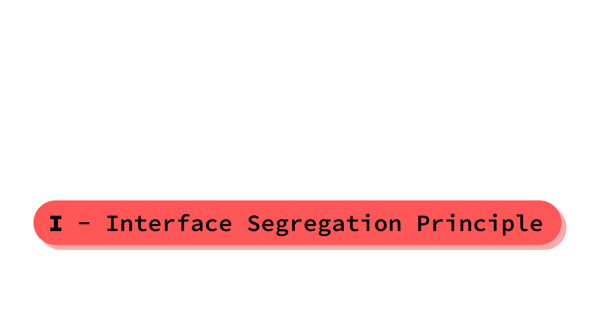

known as interface segregation

------
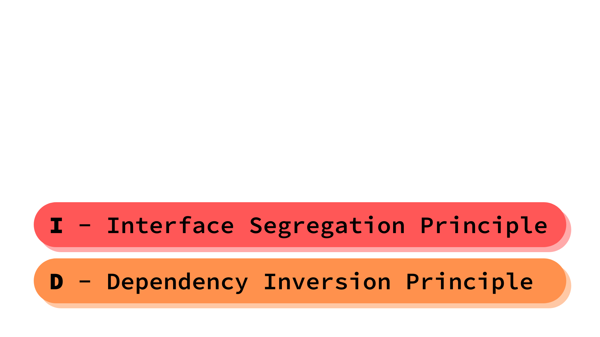

and dependency inversion

Which together both dictate that functionality should depend on abstractions, not data that's been generated by some unknown entity.

------
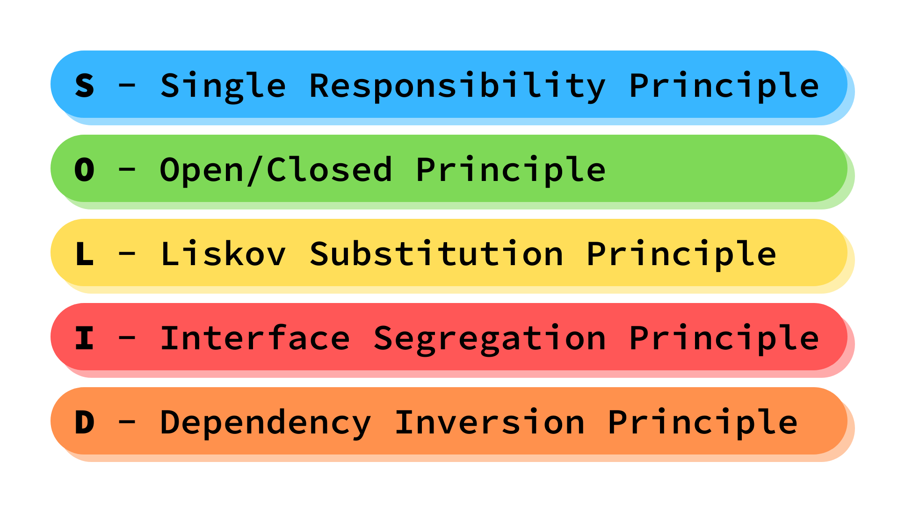

And if you're curious for more, these both come from a set of 5 called SOLID.

------


But if you're not aware of these principles (or you find them easy to forget) then I think a better methodology that I found useful is always telling myself, 

------
<!-- .element: data-background-image="images/fist.gif" -->

There's got to be a better way.

------
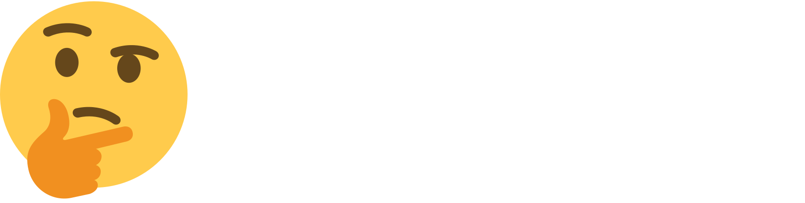

It might take some thinking,

------
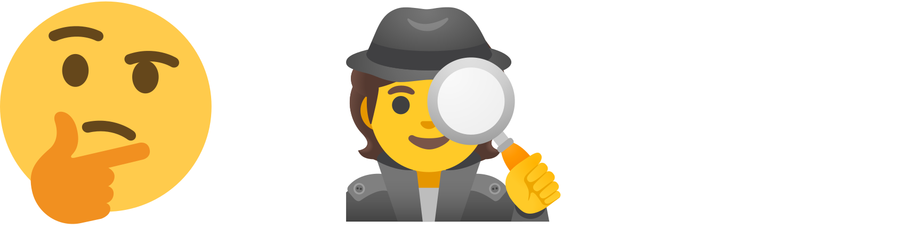

research,

------


or time, to find what's available to make code simpler, shorter, and better.

But I would've never gotten there if I wasn't always thinking about how to do better.


---


Now that we've got a way to find issues in our code, we need a way to easily address them.

------


And I found the easiest way to do that, is to use an Integrated Development Environment  like PyCharm.

IDEs like PyCharm are quite powerful, letting you out of the box easily do refactoring without any setup!

------
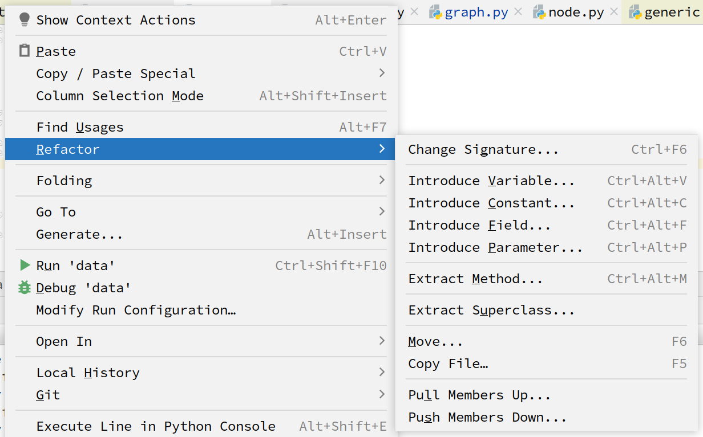

I mean look, it has a refactoring menu!

And some things that I found quite helpful were:

------
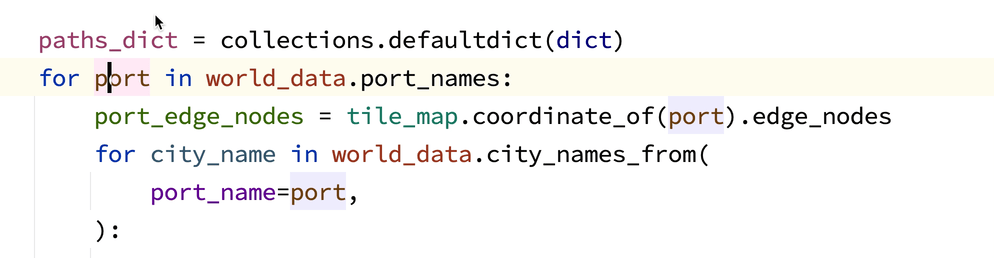<!-- .element: style="height: unset; width: 88.75vw;" -->

renaming variables everywhere within my project,

------
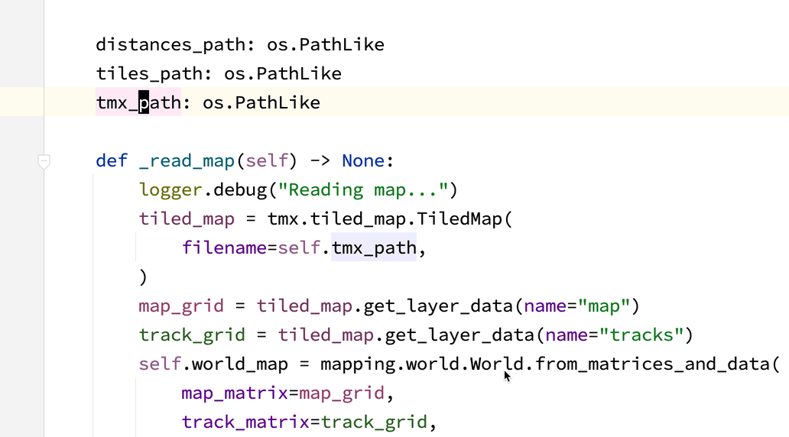

or fields and methods throughout the entire project!

------
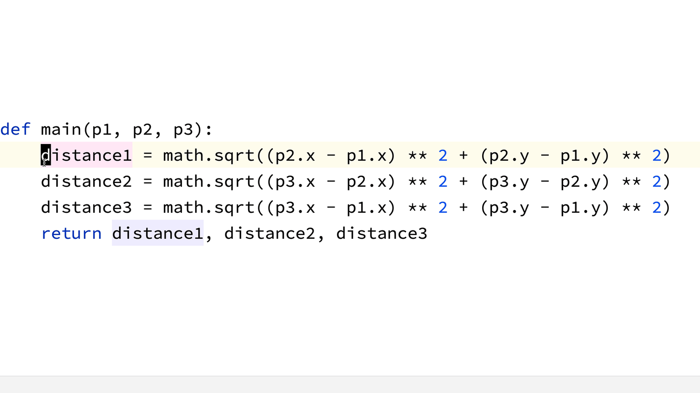

extracting repeated blocks of code into a function,

------
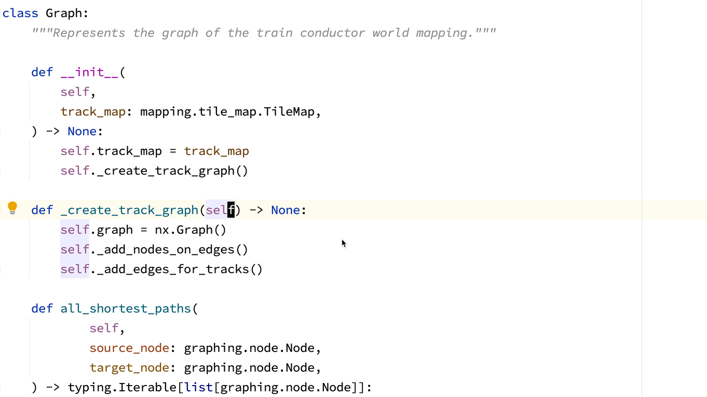

changing the signature of a function's definition and updating for everywhere that it get's called.

------
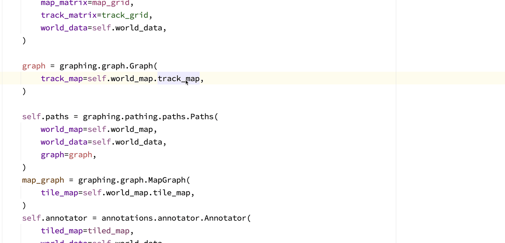

listing usages and quickly navigating between them

------
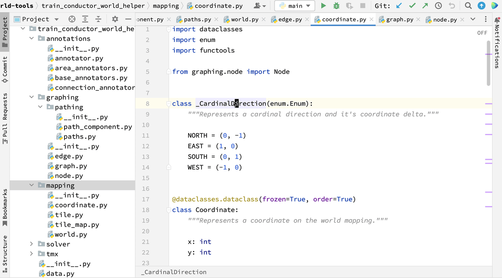

moving files between folders and updating their usages accordingly

------
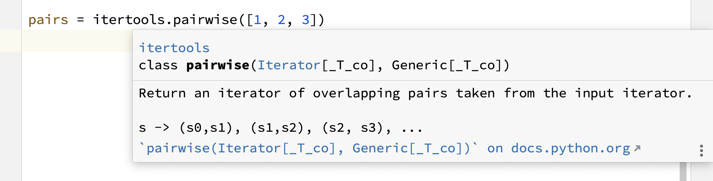<!-- .element: style="height: unset; width: 88.75vw;" -->

and showing documentation

------


And look, I know what you might be thinking.

------


"Can't amazing lightweight editors like vim and vscode do all that too?"
And as someone whose used both, I'm sure it could! 

------


But after I had put my pragmatic hat back on, I thought to myself...

is it really worth all the effort it would take to set that up, when all of this comes out of the box for free?

{1:30 (9:45)}

---

| | |
|---|--:|
|`str`|`"string"`|
|`int`|`0`|
|`float`|`0.5`|
|`list`|`[1, 2, 3]`|
|`tuple`|`(1, 2, 3)`|
|`dict`|`{"key", "value"}`|
|`set`|`{1}`|
| | |

Now something I forgot to mention that an IDE can also do is help you with types

------
```python
def add(x: int, y: int) -> int:
    return x + y
```

Unlike other languages, when we're writing small python scripts, it might not be worthwhile to have types.

But as our project grows, type hinting can become super helpful for quite a few reasons.

One of those is spotting inevitable human errors...

------
```python
def compute_difficult_paths() -> list
    return networkx.paths()
```

Like here, we write our code explicitly expecting a list

But networkx.paths() returns a generator!

------
<!-- .element: data-auto-animate -->
```python [2]
>>> def annotate_paths():
...    cached_paths = compute_difficult_paths()
...    for path in cached_paths:
...        print("first iteration: ", path)
...    print("done!")
... 
first iteration: [1, 2, 3]
first iteration: [4, 5]
done!
```
<!-- .element: data-id="annotate" -->

So for example, if we save it as a variable here

------
<!-- .element: data-auto-animate -->
```python [3-5]
>>> def annotate_paths():
...    cached_paths = compute_difficult_paths()
...    for path in cached_paths:
...        print("first iteration: ", path)
...    print("done!")
... 
first iteration: [1, 2, 3]
first iteration: [4, 5]
done!
```
<!-- .element: data-id="annotate" -->

And then iterate over it once...

------
<!-- .element: data-auto-animate -->
```python [6-9]
>>> def annotate_paths():
...    cached_paths = compute_difficult_paths()
...    for path in cached_paths:
...        print("first iteration: ", path)
...    print("done!")
... 
first iteration: [1, 2, 3]
first iteration: [4, 5]
done!
```
<!-- .element: data-id="annotate" -->

we'll get the expected output.

------
<!-- .element: data-auto-animate -->
```python [6-8]
>>> def annotate_paths():
...    cached_paths = compute_difficult_paths()
...    for path in cached_paths:
...        print("first iteration: ", path)
...    print("done!")
...    for path in cached_paths:
...        print("second iteration: ", path)
...    print("done!")
... 
first iteration: [1, 2, 3]
first iteration: [4, 5]
done!
```
<!-- .element: data-id="annotate" -->

But because it's a generator, when we iterate over it again.

------
<!-- .element: data-auto-animate -->
```python [10-12]
>>> def annotate_paths():
...    cached_paths = compute_difficult_paths()
...    for path in cached_paths:
...        print("first iteration: ", path)
...    print("done!")
...    for path in cached_paths:
...        print("second iteration: ", path)
...    print("done!")
... 
first iteration: [1, 2, 3]
first iteration: [4, 5]
done!
```
<!-- .element: data-id="annotate" -->

Nothing will happen since it's been exhausted, even though we might expect that from a list.

------
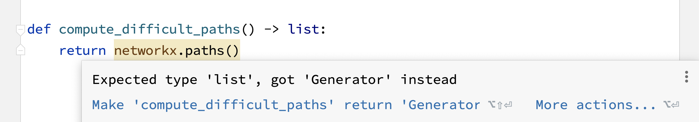<!-- .element: style="height: unset;" -->

but with the right tools, errors like this can be highlighted for us

------
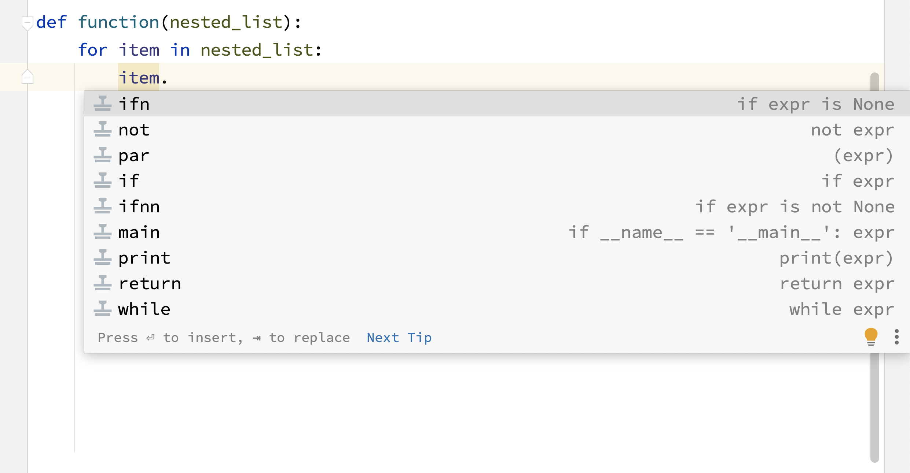

Another case is when we're unpacking a nested data type.

------
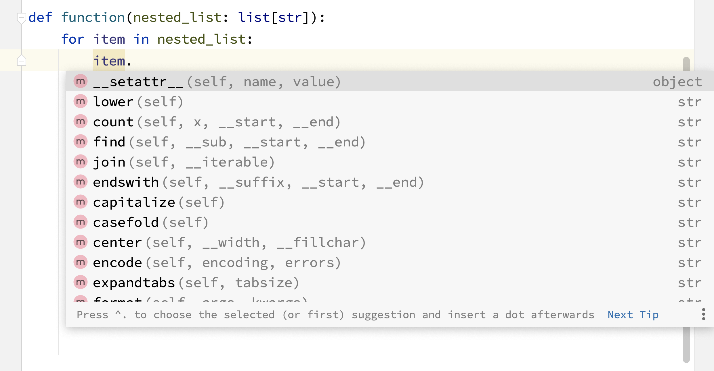

With typing, an IDE will help us work with the inner item!

------


Okay so now that we know that types are important, let's go use them.

------
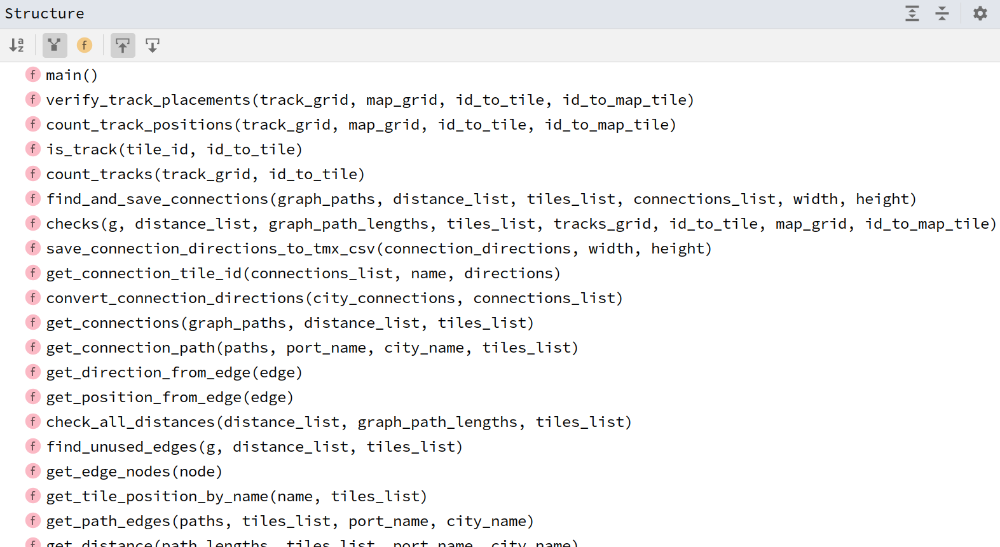

"But Evan", you might say, you have so many functions!

------


That's going to be so much work for your large project!

And you're right!

------


But, we have technology!
And we can automate finding and adding in types for us.

------
<!-- .element: data-background-image="images/monkeytype.png" -->


with a tool called monkeytype

------
```python []
def create_group_layer_from_connections(
    width,
    height,
    layer_name,
    key,
    nested,
    connection_directions,
): ...


```

Where for the following function

------
```python []
def create_group_layer_from_connections(
    width: int,
    height: int,
    layer_name: str,
    key: Callable | None,
    nested: bool,
    connection_directions: dict[str,
        dict[str, dict[tuple[int, int], int]]
        | dict[tuple[int, int], int]
    ],
) -> Group: ...
```

Can produce stubs like the following

And it will even update the existing code!

------
<!-- .element: style="height: unset;" -->

Of course, we don't NEED an IDE to benefit from type hinting, 

but once type hinting is all setup, it lets us run type checking tools like mypy to ensure the continuous checking for errors and types.

{1:45 (11:30)}

---
# ⋯

Oh I forgot to mention again!

Typing is also really helpful for documentation!

------
```python []
def connection_path(
    paths,
    port_name,
    city_name,
):
    return {
        position_from_edge(edge): direction_set_from_edge(edge)
        for edge in paths[port_name][city_name]
    }
```

Take this function with no typing for example

------
```python [1-5]
def connection_path(
    paths: dict[str, dict[str, list[?]]], 
    port_name: str,
    city_name: str,
) -> dict[?, set[?]]:
    return {
        position_from_edge(edge): direction_set_from_edge(edge)
        for edge in paths[port_name][city_name]
    }
```

We could make some guesses at what most of these would be.

------
```python [3,4]
def connection_path(
    paths: dict[str, dict[str, list[?]]], 
    port_name: str,
    city_name: str,
) -> dict[?, set[?]]:
    return {
        position_from_edge(edge): direction_set_from_edge(edge)
        for edge in paths[port_name][city_name]
    }
```

For example we could guess that these names are probably strings,

------
```python [2,8]
def connection_path(
    paths: dict[str, dict[str, ?]], 
    port_name: str,
    city_name: str,
) -> dict[?, set[?]]:
    return {
        position_from_edge(edge): direction_set_from_edge(edge)
        for edge in paths[port_name][city_name]
    }
```

And since we're using them to index paths, we could guess, that paths is a dictionary

------
```python [2,8]
def connection_path(
    paths: dict[str, dict[str, list[?]]], 
    port_name: str,
    city_name: str,
) -> dict[?, set[?]]:
    return {
        position_from_edge(edge): direction_set_from_edge(edge)
        for edge in paths[port_name][city_name]
    }
```

that stores a list, since we're iterating over the output.

------
```python [5,7]
def connection_path(
    paths: dict[str, dict[str, list[?]]], 
    port_name: str,
    city_name: str,
) -> dict[?, set[?]]:
    return {
        position_from_edge(edge): direction_set_from_edge(edge)
        for edge in paths[port_name][city_name]
    }
```

And this function says it's returning a set

------
```python [2,5]
def connection_path(
    paths: dict[str, dict[str, list[?]]], 
    port_name: str,
    city_name: str,
) -> dict[?, set[?]]:
    return {
        position_from_edge(edge): direction_set_from_edge(edge)
        for edge in paths[port_name][city_name]
    }
```

But without context, what are all these?

We have no clue what position_from_edge returns or direction_set_from_edge returns 
And therefore, we have to make guesses at why a connection path is a dictionary

------
```python [2,5]
def connection_path(
    paths: list[list[list[?]]], 
    port: int,
    city: int,
) -> dict[?, set[?]]:
    return {
        position_from_edge(edge): direction_set_from_edge(edge)
        for edge in paths[port][city]
    }
```

In fact, there's no reason why paths couldn't be a list!

------
```python [5]
def connection_path(
    paths: dict[str, dict[str, list[?]]], 
    port_name: str,
    city_name: str,
) -> dict[tuple[int, int], set[str]]:
    return {
        position_from_edge(edge): direction_set_from_edge(edge)
        for edge in paths[port_name][city_name]
    }
```

But if I properly fill in these types
Then there's a much better idea that "connection path" is actually a dictionary mapping between positions to directions

------
<!-- .element: data-auto-animate -->
```python [2]
def connection_path(
    paths: dict[str, dict[str, list[tuple[int, int]]], 
    port_name: str,
    city_name: str,
) -> dict[tuple[int, int], set[str]]:
    return {
        position_from_edge(edge): direction_set_from_edge(edge)
        for edge in paths[port_name][city_name]
    }
```
<!-- .element: data-id="typing" -->

And that paths... wait let me format that...

------
<!-- .element: data-auto-animate -->
```python [2]
def connection_path(
    paths: dict[str, dict[str, list[tuple[int, int]]], 
    port_name: str,
    city_name: str,
) -> dict[tuple[int, int], set[str]]:
```
<!-- .element: data-id="typing" -->

------
<!-- .element: data-auto-animate -->
```python [2-3]
def connection_path(
    paths: dict[str, dict[str,
        list[tuple[int, int]]], 
    port_name: str,
    city_name: str,
) -> dict[tuple[int, int], 
    set[str]]:
```
<!-- .element: data-id="typing" -->

Is actually a 2d map of names to positions

------
<!-- .element: data-auto-animate -->
```python []


def connection_path(
    paths: dict[str, dict[str,
        list[tuple[int, int]]], 
    port_name: str,
    city_name: str,
) -> dict[tuple[int, int], 
    set[str]]:
```
<!-- .element: data-id="typing" -->

And if I do some more formatting to alias the types,

------
```python [2,9,12]

Position = tuple[int, int]


def connection_path(
    paths: dict[str, dict[str,
        list[Position]], 
    port_name: str,
    city_name: str,
) -> dict[Position, 
    set[str]]:
```

then we can set tuple[int, int] to a Position

------
```python [3-4,8,10,11,13]

Position = tuple[int, int]
Direction = str
Location = str


def connection_path(
    paths: dict[Location, dict[Location, 
        list[Position]]], 
    port_name: Location,
    city_name: Location,
) -> dict[Position, 
    set[Direction]]:
```

Or (and this might be excessive)
Set aliases for the strings as well

Both making it more clear what we're returning.

------
```python [1-5,9,12]
@dataclasses.dataclass
class Position:
    x: int
    y: int
    ...

def connection_path(
    paths: dict[Location, dict[Location,
        list[Position]]], 
    port_name: Location,
    city_name: Location,
) -> dict[Position, 
    set[Direction]]:
```

But it does mean that if they need to become classes, we could then easily support that.

------


And with that, maybe it's worth asking:

---
<div class="r-stack">
    
    
</div>

How documented is your code?

------
```python
"""Returns... TBA"""

 # Not sure what this does
```

I don't just mean the number of comments and docstrings written,

------
<div class="r-stack">
    
    
</div>

or, the self documenting type hints.

What I mean is, does it speak for itself through it's naming and structure?

Like how easy is it for someone other than you to pickup and understand your code with no context?

If we take a look at what my repo would have looked like at the beginning

------
<!-- .element: data-background-image="images/tcwe_github.png" -->

Here's the github page

------
<!-- .element: data-background-image="images/tcwe_no_desc.png" -->

with no description...

------
<!-- .element: data-background-image="images/tcwe_no_docs.png" -->

And there's no documentation

------
<!-- .element: data-background-image="images/tcwe_no_readme.png" -->

or readme for where to start,

so maybe we have to read some code.

------
<!-- .element: data-background-image="images/tcwe_too_many_files.png" -->

But it's not clear which of all of these files are that code.

------
<!-- .element: data-background-image="images/tcwe_too_many_lines.png" -->

And even once we find the file,

------
<!-- .element: data-background-image="images/tcwe_too_many_lines_thousands.png" -->

it's thousands of lines long

------
<!-- .element: data-background-image="images/tcwe_end_file.png" -->

And there's no main function to signify where to start...

------


If this was an actual repo, I would've given up my hopes of using or contributing to it by now...

Which goes to show

------


The easier your code is to pickup and understand with no context, the easier it will be for others to answer their questions or contribute.

Now in comparison, we could look at what I ended up with

------
<!-- .element: data-background-image="images/tcwt_github.png" -->

Here's the main repo, with only a few files

------
<!-- .element: data-background-image="images/tcwt_2.png" -->

And if we scroll down, we'll find the readme

------
<!-- .element: data-background-image="images/tcwt_2_entry_point.png" -->

which says the entry point is in the main file in the directory

------
<!-- .element: data-background-image="images/tcwh_folder_helper.png" -->

If we go to that directory

------
<!-- .element: data-background-image="images/tcwh_folder_main.png" -->

we can easily find the main file

------
<!-- .element: data-background-image="images/tcwt_4.png" -->

and if we go to the bottom of the file,

------
<!-- .element: data-background-image="images/tcwt_4_main.png" -->

we'll find the main method

------
<!-- .element: data-background-image="images/tcwt_4_update_function_2.png" -->

where we'll see that the function being run comes from the helper 

------
<!-- .element: data-background-image="images/tcwt_5.png" -->

and if we go to the helper 

------
<!-- .element: data-background-image="images/tcwt-5.png" -->

we can then easily follow what comes next after update_map

------
```bash
train_conductor_world_helper
├── data.py
├── helper.py
├── main.py
├── stats.py
├── updater.py
├── validations.py
├── annotations
│   ├── annotator.py
│   ├── area_annotators.py
│   ├── base_annotators.py
│   └── connection_annotators.py
├── graphing
│   ├── edge.py
│   ├── graph.py
│   ├── node.py
│   └── pathing
│       ├── path_component.py
│       └── paths.py
├── mapping
│   ├── coordinate.py
│   ├── tile.py
│   ├── tile_map.py
│   └── world.py
├── solver
│   └── solver.py
└── tmx
    ├── main.py
    └── tiled_map.py
```

In fact if we look at the entire structure as a whole

you can see how all these classes and packages make it much easier to reason about all the different components of the project


------


Not only that, but it embraces another important programming principle

------
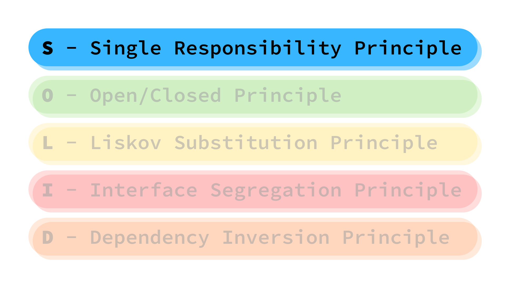

This time, the single responsibility principle, which says that everything should only ever have one responsibility.

------
```python
def main():
    world_data = data.Data(
        distances_filename="distances.json",
        tiles_filename="tiles.json",
    )

    distance_dict = world_data.create_distance_dict()
    id_to_tile_dict = world_data.create_id_to_tile_dict()
    distance_list = world_data.create_distance_list(PORT_LIMIT)
    connection_to_tile_id = world_data.create_connection_to_tile_id()

    tmx_filename = "train-conductor-world.bak.tmx"
    tmx_map = tmx.TiledMap(tmx_filename)

    map_grid = tmx_map.get_layer_data("map")
    track_grid = tmx_map.get_layer_data("tracks")

    world_map = train_conductor_world_map.World.from_matrices_and_data(
        map_matrix=map_grid,
        track_matrix=track_grid,
        id_to_tile_dict=id_to_tile_dict,
    )

    g = graphing.Graphing(
        world_map=world_map,
    )
    min_paths_dict = g.create_min_path_lookup_dict(
        distance_list=distance_list,
    )
    all_edges = g.get_all_edges()

    stats.count_tracks(
        world_map=world_map,
    )
    stats.print_track_positions_count(
        world_map=world_map,
    )
    stats.find_unused_edges(
        all_edges=all_edges,
        distance_list=distance_list,
        min_paths_dict=min_paths_dict,
    )

    validations.validate_track_placements(
        world_map=world_map
    )
    validations.validate_distances(
        distance_list=distance_list,
        distance_dict=distance_dict,
        min_paths_dict=min_paths_dict,
    )

    find_and_save_connections(
        distance_list,
        tmx_map,
        min_paths_dict,
        connection_to_tile_id=connection_to_tile_id,
    )
```

You can see the impact if we compare the main function from when I first started, it's quite long...

Actually lets go on a tangent while I'm here. You might have seen the extensive use of named arguments (`world_map`), which at times might seem redundant.

---
<div class="r-stack">
    
    
</div>

But that's because I have utmost adoration for python's beautiful function argument system.

Let me explain why....

------
```java
rect(
    int width,
    int height,
    int rotation
);
```

If we're using another language, and we want to setup rotation to default to 0

------
```java
rect(
    int width,
    int height
) {
    rect(width, height, 0);
}
```

then we often need a function override

------
```python [4]
def rect(
    width,
    height,
    rotation=0,
): ...
```

But since python has default arguments

------
```python
normal = rect(width, height)
rotated = rect(width, height, rotation)
```

there's no need for chained overrides

------
```java
Rect.builder(height, width)
    .build();
```

often though, builders are constructed to resolve this issues

------
```java
Rect.builder(height, width)
    .withRotation(rotation)
    .build();
```

that let us optionally add data

------
```java [1]
Rect.builder(height, width)
    .build();
```

but yet another issue lies, due to the nature of the required ordered arguments.
And that is that there's no knowing whether the arguments are set correctly 

------
```java [1]
Rect.builder(width, height)
    .build();
```

(they should be width and height!)

------
```python
Rect(
    width=width,
    height=height,
)
```

Python resolves this with named arguments (and thus also does away with builders)

------
```python
rect(
    width=1,
    height=2,
)
```

Meaning that not only are your functions self documenting by having constant arguments labelled

------
```python
rect(
    height=2,
    width=1,
)
```

But now your argument ordering is redundant!

------
```python
rect(
    height=height,
    width=width,
)
```

Thus, by always using named arguments, your code is always future proofed against errors under chases where arguments are inserted or ordering is changed.

------
<!-- .element: data-background-image="images/sprints.svg"-->

And if this opened your eyes, I'll be at the sprints if you want to contribute to automatically finding and applying these guardrails and enhancements!

Anyways, where were we? Ah yes, 

---
```python
def main():
    world_data = data.Data(
        distances_filename="distances.json",
        tiles_filename="tiles.json",
    )

    distance_dict = world_data.create_distance_dict()
    id_to_tile_dict = world_data.create_id_to_tile_dict()
    distance_list = world_data.create_distance_list(PORT_LIMIT)
    connection_to_tile_id = world_data.create_connection_to_tile_id()

    tmx_filename = "train-conductor-world.bak.tmx"
    tmx_map = tmx.TiledMap(tmx_filename)

    map_grid = tmx_map.get_layer_data("map")
    track_grid = tmx_map.get_layer_data("tracks")

    world_map = train_conductor_world_map.World.from_matrices_and_data(
        map_matrix=map_grid,
        track_matrix=track_grid,
        id_to_tile_dict=id_to_tile_dict,
    )
``````

The main function was still way too long

------
```python
├── data.py
├── graphing.py
├── graph.py
├── main.py
├── stats.py
├── tmx
│   └── tmx.py
├── train_conductor_world_map.py
├── utils.py
└── validations.py
```

And if we looked at the files

------
```python [2-3]
├── data.py
├── graphing.py
├── graph.py
├── main.py
├── stats.py
├── tmx
│   └── tmx.py
├── train_conductor_world_map.py
├── utils.py
└── validations.py
```

What's the difference between graphing and graph?

------
```python
@dataclasses.dataclass(frozen=True, order=True)
class Node:
    x: float
    y: float

    def __str__(self):
        return f"({self.x}, {self.y})"


@dataclasses.dataclass(frozen=True, order=True)
class Edge:
    first: Node
    second: Node
    
    def __str__(self):
        return f"{self.first}-{self.second}"

    def get_position(self):
        n1, n2 = self.first, self.second
        x1, y1 = n1.x, n1.y
        x2, y2 = n2.x, n2.y
        if y1 == y2:
            y = y1
            x = (x1 + x2) / 2
        elif x1 == x2:
            x = x1
            y = (y1 + y2) / 2
        else:
            x = x1 if x1.is_integer() else x2
            y = y1 if y1.is_integer() else y2
        return (int(x), int(y))

    def get_direction(self) -> str:
        n1, n2 = self.first, self.second
        x1, y1 = n1.x, n1.y
        x2, y2 = n2.x, n2.y
        if y1 == y2:
            return "horizontal"
        if x1 == x2:
            return "vertical"
        pos = self.get_position()
        directions = {value: key for key, value in get_edge_nodes(pos).items()}
        edge_directions = {
            directions[n1],
            directions[n2],
        }
        if edge_directions == {"up", "left"}:
            return "up_left"
        if edge_directions == {"up", "right"}:
            return "up_right"
        if edge_directions == {"down", "left"}:
            return "down_left"
        if edge_directions == {"down", "right"}:
            return "down_right"
        raise ValueError("Expected to return a direction.")
```

Well graph is storing two data classes, one being quite long... (scroll)

------
```python [4-5]
├── data.py
├── graphing.py
├── graph
│   ├── edge.py
│   └── node.py
├── main.py
├── stats.py
├── tmx
│   └── tmx.py
├── train_conductor_world_map.py
├── utils.py
└── validations.py
```

When instead, we could split these out to their own single files

------


This might be of concern given the extra imports and files to jump around through.

But that's a tradeoff to consider depending on your class length

---


Okay now that we've started to update our code, what else can we do?

Well another good principle to follow is

------
<!-- .element: data-background-image="images/dry_black.svg"-->

DRY

------
<!-- .element: data-background-image="images/dry_full.svg"-->

or Don't repeat yourself

DRY is important for so many reasons!

------
```python
distance_1 = math.sqrt((p2.x - p1.x)**2 + (p2.y - p1.y)**2)
distance_2 = math.sqrt((p3.x - p2.x)**2 + (p2.y - p1.y)**2)
distance_3 = math.sqrt((p3.x - p1.x)**2 + (p3.y - p1.y)**2)
```

Here, we have some code that repeatedly calculates distances.

We could refactor it...

------
```python [1-4]
def distance(point_1, point_2):
    return math.sqrt(
        (point_2.x - point_1.x)**2
        + (point_2.y - point_1.y)**2
    )

distance_1 = math.sqrt((p2.x - p1.x)**2 + (p2.y - p1.y)**2)
distance_2 = math.sqrt((p3.x - p2.x)**2 + (p2.y - p1.y)**2)
distance_3 = math.sqrt((p3.x - p1.x)**2 + (p3.y - p1.y)**2)
```

first by introducing a function for abstraction

------
```python [7-9]
def distance(point_1, point_2):
    return math.sqrt(
        (point_2.x - point_1.x)**2
        + (point_2.y - point_1.y)**2
    )

distance_1 = distance(p1, p2)
distance_2 = distance(p2, p3)
distance_3 = distance(p3, p1)
```

And then by using that function to provide consistency

------
```python [7-10]
def distance(point_1, point_2):
    return math.sqrt(
        (point_2.x - point_1.x)**2
        + (point_2.y - point_1.y)**2
    )

distances = [
    distance(point_2, point_1)
    point_1, point_2
    for point_1, point_2 in points
]
```

and finally by introducing a loop

------
```python 
def distance(point_1, point_2):
    return math.sqrt(
        (point_2.x - point_1.x)**2
        + (point_2.y - point_1.y)**2
    )

distances = [
    distance(point_2, point_1)
    point_1, point_2
    for point_1, point_2 in points
]
```

Our code is now cleaner and safer, by providing safety through reassurance that everything is running in the same way.

------
```python [2]
distance_1 = math.sqrt((p2.x - p1.x)**2 + (p2.y - p1.y)**2)
distance_2 = math.sqrt((p3.x - p2.x)**2 + (p2.y - p1.y)**2)
distance_3 = math.sqrt((p3.x - p1.x)**2 + (p3.y - p1.y)**2)
```

For example, did you notice that there was a bug in the first example?

At the end, it should actually be `p3.y - p2.y`

------
```python
def distance(point_1, point_2):
    return math.sqrt(
        (point_2.x - point_1.x)**2
        + (point_2.y - point_1.y)**2
    )
```

DRY also allows us to be more efficient, because now, we don't need to copy or re-write code to calculate distance.

------
```python [5]
def distance(point_1, point_2):
    return (
        (point_2.x - point_1.x)**2
        + (point_2.y - point_1.y)**2
    ) ** 0.5
```

Or when we want to make changes, like fixing a bug, or in this case, changing the method of sqrt,
we now only need to do it in one place, and can ensure that that bug fix or functionality is being used everywhere.

------


But where did I apply it in my code?

------
```python
widths = list(map(len, grid))
for row, (width, next_width) in enumerate(
    itertools.pairwise(widths)
):
    if width != next_width:
        raise ValueError(
            f"Length of row {row + 1}"
            f" was different ({width} != {next_width})"
        )
```

Well one example is this validation code here, that was being used in two places.

------
```python [1-2]
# utils.py
"""Collection of utility functions"""

def get_width(grid: list[list[int]]) -> int:
    widths = list(map(len, grid))
    for row, (width, next_width) in enumerate(
        itertools.pairwise(widths)
    ):
        if width != next_width:
            raise ValueError(
                f"Length of row {row + 1}"
                f" was different ({width} != {next_width})"
            )
    return width
```

Our first thought might be to create a Utils class.
But this is often not a good idea, as it creates a new dependency, that incentivises us to add more small functionality that there isn't a good context for.

------
```python [1-2]
# validations.py
"""Collection of validation functions"""

def validate_width(grid: list[list[int]]) -> int:
    widths = list(map(len, grid))
    for row, (width, next_width) in enumerate(
        itertools.pairwise(widths)
    ):
        if width != next_width:
            raise ValueError(
                f"Length of row {row + 1}"
                f" was different ({width} != {next_width})"
            )
    return width
```

Instead, this could be moved to be inside validations

------
```python [4]
# validations.py
"""Collection of validation functions"""

def validate_width(grid: list[list[int]]) -> int:
    widths = list(map(len, grid))
    for row, (width, next_width) in enumerate(
        itertools.pairwise(widths)
    ):
        if width != next_width:
            raise ValueError(
                f"Length of row {row + 1}"
                f" was different ({width} != {next_width})"
            )
    return width
```

and renamed to validate_width

------


Or maybe what we should really do, is ask ourselves, do we really need this?

------
```python
class RectangularGrid:
    """A grid that ensures all rows are of the same length."""
    ...
```

Maybe it would be better to instead create a grid class that ensures all rows are of the same width.

Or maybe we should ask ourselves 

------
<!-- .element: data-background-image="images/fist.gif" -->

if there's a better way, and remove the need for this entirely, to instead deal with the issue when it appears.

---


Another place we could remove repeated code is during the annotations.

------
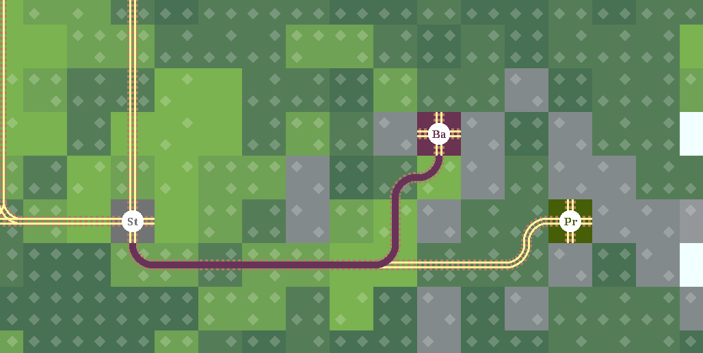<!-- .element: style="height: unset; width: 88.75vw;" -->

In my map, annotations are what colors the path between a port and a city.

------
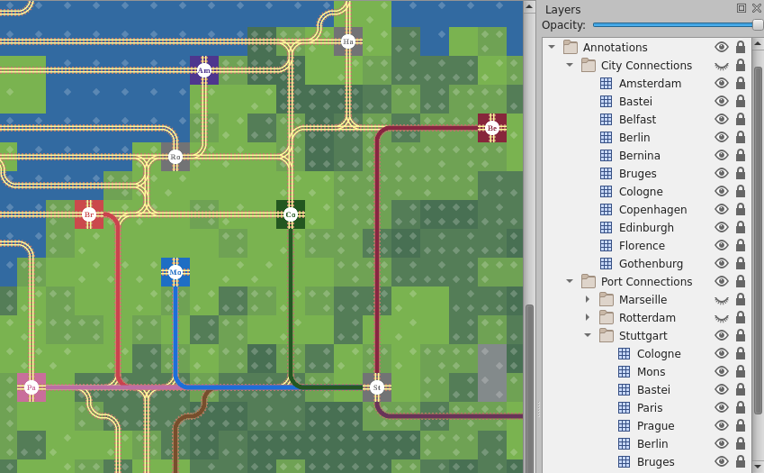

And there are grouped annotations for both ports and cities.
However, even though these are very similar, and are done via the same mechanism,

------
```python [2-3,6-8]
city_layer = create_group_layer_from_connections(
    connection_directions=city_connection_directions,
    layer_name="Cities",
)
port_layer = create_group_layer_from_connections(
    connection_directions=port_connection_directions,
    layer_name="Ports",
    nested=True,
)
```

We need to implement this slight difference since ports are annotated through nesting.
But conceptually, this is just like recursion with a base case, and it made me think

------
<!-- .element: data-background-image="images/fist.gif" -->

There must be a better way!

------
```python
city_names_and_position_id_functions = [
    (
        city_name, self.port_position_to_id_function(
            port_name=port_name,
            city_name=city_name
        )
    )
    for city_name in self.get_city_names_from_port(
        port_name=port_name
    )
]
```

So I ingeniously thought of this

Which creates a nested list of specialised functions to be called with another generic function that could be used for both cities and ports and thus deduplicate our code.

Did you get that?

No? Great, cause I quickly realised I didn't either.

------


And even though I learned that while I could give myself a pat on the back for this "ingenuity"

------
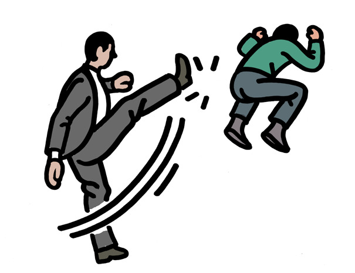

What I really learned was that I should give myself a kick in the bum for the added complexity.

Because sometimes, using neat coding tricks to simplify code is not the best idea.

------
```python
l=list(map(int,input()or"0"))
print("Invalid")if (sum([m*d for m,d in zip(list(range(19,-1,-2)),reversed(l))])+10*(l[0]-1))%89or len(l)!=11 else print("Valid")
```

If it was, all our code would be golfed to be as short as possible!

And that's just not readable...

------


So it's often worth considering, will the method of our refactoring really help?

Or more importantly, (and bringing up another principle), 

------
<!-- .element: data-background-image="images/kiss.svg"-->

are we Keeping it Simple Stupid?

Our aim should always be to simplify our code and remove what might not be needed, not introduce added complexity.

------
```python
@dataclasses.dataclass
class TileLayerAnnotator(LayerAnnotator):
    """Base annotator for layers with tiles."""

    width: int
    height: int
    layer_name: str

    def coordinate_to_tile_id(
        self,
        coordinate: mapping.coordinate.Coordinate,
    ) -> int:
        """Returns a tile id given a coordinate."""
        raise NotImplementedError
```

Eventually I settled on a class like this

------
```
class MyTileLayerAnnotator(TileLayerAnnotator):
    def coordinate_to_tile_id(
        self,
        coordinate: mapping.coordinate.Coordinate,
    ) -> int:
        return self._id(coordinate)
```

that could be inherited and overridden to provide the extensibility that I was looking for.

------


But was that extensibility that I needed?

Maybe it's worth consulting another principle

------
<!-- .element: data-background-image="images/yagni_black.svg"-->

yagni or

------
<!-- .element: data-background-image="images/yagni_full.svg"-->

Because, should we really be refactoring for things that don't exist?

Thus, I'll still always have the feeling that

------
<!-- .element: data-background-image="images/fist.gif" -->

there's got to be a better way...

---
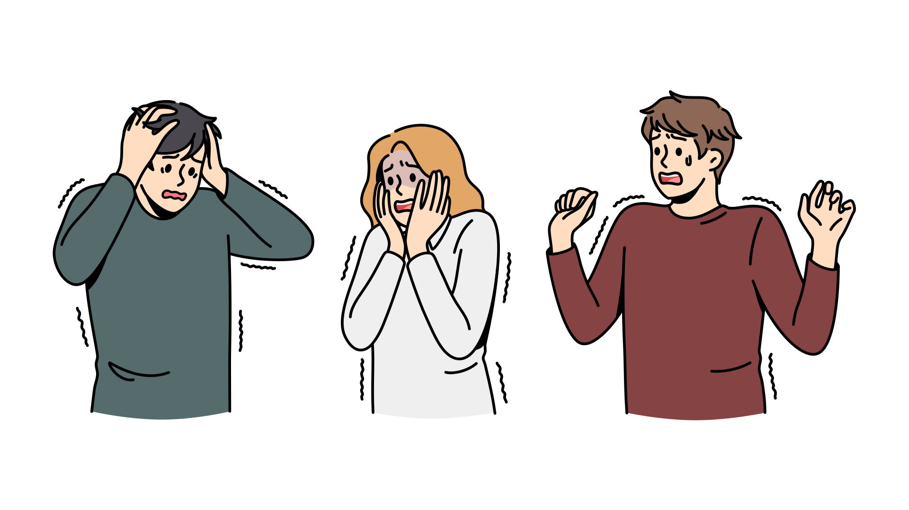

Okay, but how can we be confident that we can make all these changes, while keeping functionality the same?

------
<div>

</div>

Well isn't that what tests are for?

------
<div class="r-stack">
  
  
</div>

In fact, having good tests is likely one of the most important things to have while refactoring.

Because if we have tests to lean on, we can make all the changes we want, run our tests, and if they pass then we're good to go!

------
<div class="r-stack">
  
  
</div>

Tests aren't always the easiest thing to set up though, especially under complexity.

------


But even having very basic tests where the program correctness might even be manually verified is better than nothing!

------


Since once that's done, it can be a starting point into automating it using integration tests, since with lots of refactoring, unit tests may require too many changes.

For example...

------
```python
class Data:

    def __init__(
        self,
        distances_filename: os.PathLike,
        tiles_filename: os.PathLike,
    ):
        distances_json_dict = self._read_json(
            json_filename=distances_filename,
        )
        self._port_to_city_distance = self._create_port_to_city_distance_dict(
            distances_json=distances_json_dict,
        )
        ...
```

The Data class

------
```python [5-6]
class Data:

    def __init__(
        self,
        distances_filename: os.PathLike,
        tiles_filename: os.PathLike,
    ):
        distances_json_dict = self._read_json(
            json_filename=distances_filename,
        )
        self._port_to_city_distance = self._create_port_to_city_distance_dict(
            distances_json=distances_json_dict,
        )
        ...
```

that takes in some filenames

------
```python [8-11]
class Data:

    def __init__(
        self,
        distances_filename: os.PathLike,
        tiles_filename: os.PathLike,
    ):
        distances_json_dict = self._read_json(
            json_filename=distances_filename,
        )
        self._port_to_city_distance = self._create_port_to_city_distance_dict(
            distances_json=distances_json_dict,
        )
        ...
```

And creates some state, can be easily tested via an integration test.

------
```python
def test_distance_between():
    data = Data(
        distances_filename="simple_distances.json",
    )
    assert data.distance_between(
        port_name="Dijon", 
        city_name="Lyon",
    ) == 5
```

As in our test,

------
```python [3]
def test_distance_between():
    data = Data(
        distances_filename="simple_distances.json",
    )
    assert data.distance_between(
        port_name="Dijon", 
        city_name="Lyon",
    ) == 5
```

We could just create the file to test against

But it may become really hard to test the functions of a class like this, 

as different files would need to be created for every test.

Not only that, but it's not clear what's inside these files.

------
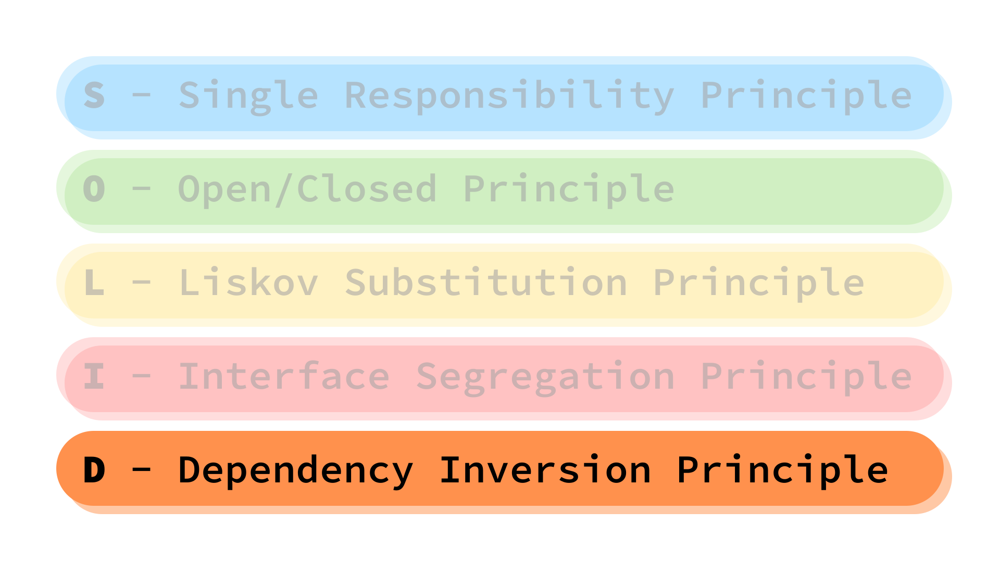

If you haven't noticed, this is because it violates the Dependency Inversion principle.

------
```python
@dataclasses.dataclass
class Data:

    port_to_city_distances: dict[str, dict[str, int]]
    
    ...
```

And a way we can fix that is to instead change our class to be composed of this data.

------
```python [2-5]
@classmethod
def from_file(cls, distances_filename: str):
    distances_json_dict = self._read_json(
        json_filename=distances_filename,
    )
    port_to_city_distances = self._create_port_to_city_distance_dict(
        distances_json=distances_json_dict,
    )
    return cls(
        port_to_city_distances=port_to_city_distances,
    )
```

And then use a classmethod that would take in these filenames

------
```python [6-8]
@classmethod
def from_file(cls, distances_filename: str):
    distances_json_dict = self._read_json(
        json_filename=distances_filename,
    )
    port_to_city_distances = self._create_port_to_city_distance_dict(
        distances_json=distances_json_dict,
    )
    return cls(
        port_to_city_distances=port_to_city_distances,
    )
```

and create the data needed

------
```python [9-11]
@classmethod
def from_file(cls, distances_filename: str):
    distances_json_dict = self._read_json(
        json_filename=distances_filename,
    )
    port_to_city_distances = self._create_port_to_city_distance_dict(
        distances_json=distances_json_dict,
    )
    return cls(
        port_to_city_distances=port_to_city_distances,
    )
```

to pass into the class.

------
```python
data = Data.from_filename(
    distances_filename="distances.json",
)
```

Now in our code we can continue to create data using the filenames

------
```python
def test_distance_between():
    port_name = "Dijon"
    city_name = "Lyon"
    distance = 5
    data = Data(
        port_to_city_distances={port_name: {city_name: distance}},
    )
    assert data.distance_between(
        port_name=port_name, 
        city_name=city_name,
    ) == distance
```

But now in our tests, we can specify the data that we want to be used, which makes things much clearer!

---
<div class="r-stack">


</div>

Now while tests might ensure that your program stays they same, they don't really ensure that the program doesn't slow down.

It's often not obvious when code can be slow, especially with Python, and more so when we're trying to ensure we're not spending time in premature optimization.

------
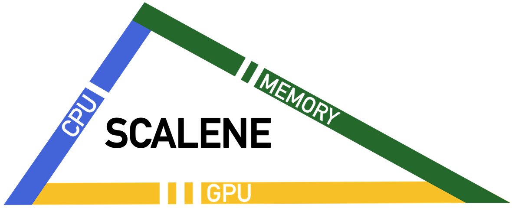

This is where a profiler, like Scalene, can be helpful in analysing the runtime of our code to determine where there's inefficiencies in computation or memory

------
<!-- .element: data-background-image="images/scalene_coordinate.png" -->

For example, this was the output I got when I started to notice that my code started to be slow, and couldn't figure out the change I made that caused it.

------
<!-- .element: data-background-image="images/scalene_coordinate_annotated.png" -->

And here, we see that the cause was during the creation of Coordinates

------
```python [6-10]
@dataclasses.dataclass
class Coordinate:
    x: int
    y: int

    def __post_init__(self):
        self.edge_nodes = {
            self._direction_to_node(direction)
            for direction in Direction
        }
```

Because I had setup my code in such a way to compute the values of a field on the classes' creation, but the edge_nodes aren't always needed.

------
```python
def edge_nodes():
    ...

coordinate.edge_nodes()
```

Instead, I could move this field to a function instead, only being run when needed.

------
```python
coordinate.edge_nodes
```

But maybe I wanted this as a property, since it's nicer to read, and implies that it's a value that shouldn't change.

------
```python
@property
def edge_nodes():
    ...

coordinate.edge_nodes
```

Well we can do that with the property builtin decorator, which lets us return a function's output as a field

But a value shouldn't always be re-computed if it's going to return the same thing.

This is where

------
```python
@functools.cache
def edge_nodes():
    ...

coordinate.edge_nodes()
```

the functools.cache decorator comes in, which saves the output of a function so that we don't have to re-compute it. This is great for values that we access many times, but we only want to compute once.

------
```python
@property
@functools.cache
def edge_nodes():
    ...

coordinate.edge_nodes
```

We could use both to solve the issue, however this can lead to memory leaks, as the cache may retain instance references, preventing garbage collection.

------
```python
@functools.cached_property
def edge_nodes():
    ...

coordinate.edge_nodes
```

The solution is the cached_property decorator, which does both in one go!
Easily one of my favourite Python builtins, and one that resolves so many linter warnings too!

------


Alright, that's our profiling and optimisation done...

{2 min (25:45)}

---
<!-- .element: data-background-image="images/storybook_clock.png" -->

But I wonder whether my refactoring story would be fast or slow If I profiled it.

"How much time do I have left?"

Okay wow that was quite a fun story!

------


You might be wondering though, what about the profit?
Did I get the help I needed?

Yes! Although there's still more to figure out. 

------


And while you could say that there is profit in saving time in future.

------


I think the real profit though was everything I learnt along the way.

------
<br>
github.com/ekohilas/refactoring-for-fun-and-profit
<!-- .element: class="r-fit-text" -->

And if you wanted to profit yourself, I've put up some resources here that you can reference later! 

------
# Thanks! Questions?
<!-- .element: class="r-fit-text" -->
# @ekohilas

I want to say thanks to my partner and all my friends for supporting me.

And thanks to all of you for listening!

I would love to hear any feedback that you have.

And you can find me on online at @ekohilas, or on github if you wanted to take a look at the code.

However I won't claim my code is perfect, because... I think there's always a better way!

You can also fin me in person, right here, as I think we still have some time for questions!

Thank you!
